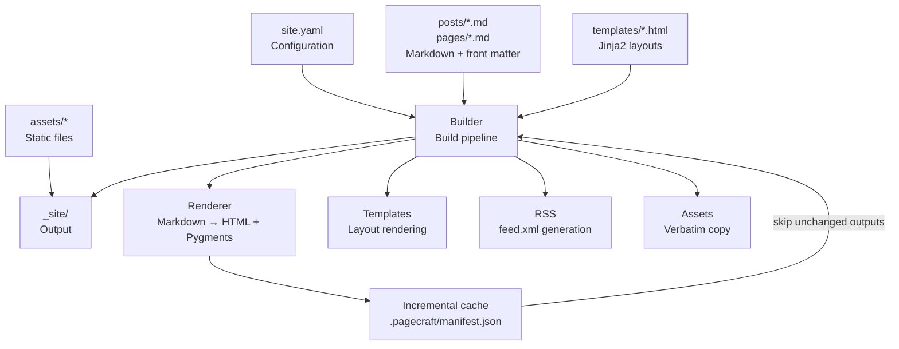

```
 ██████╗ ██╗      ██████╗  █████╗ ██╗     ██╗     ███████╗██████╗
 ██╔══██╗██║     ██╔═══██╗██╔══██╗██║     ██║     ██╔════╝██╔══██╗
 ██████╔╝██║     ██║   ██║███████║██║     ██║     █████╗  ██████╔╝
 ██╔═══╝ ██║     ██║   ██║██╔══██║██║     ██║     ██╔══╝  ██╔══██╗
 ██║     ███████╗╚██████╔╝██║  ██║███████╗███████╗███████╗██║  ██║
 ╚═╝     ╚══════╝ ╚═════╝ ╚═╝  ╚═╝╚══════╝╚══════╝╚══════╝╚═╝  ╚═╝
```

# Pagecraft

**A Markdown-to-HTML static site generator with layouts, tags, RSS feeds, syntax highlighting, asset copying, and incremental builds.**

Drop Markdown files into a folder, add a bit of front matter, and Pagecraft turns them into a polished, fast, static website — no framework, no build server, no ceremony.

[](https://github.com/vincenzo-afk/Pagecraft/blob/main/LICENSE)
[](https://www.python.org/downloads/)
[](https://github.com/vincenzo-afk/Pagecraft/tree/main/tests)

**Quick links:** [Report Bug](https://github.com/vincenzo-afk/Pagecraft/issues/new) · [Request Feature](https://github.com/vincenzo-afk/Pagecraft/issues/new)

---

## <a name="toc"></a>Table of Contents

1. [About](#about)
2. [Architecture](#architecture)
3. [Tech Stack](#tech-stack)
4. [Prerequisites](#prerequisites)
5. [Installation](#installation)
6. [Configuration](#configuration)
7. [Usage](#usage)
8. [CLI Reference](#cli-reference)
9. [Project Structure](#project-structure)
10. [Features](#features)
11. [Testing](#testing)
12. [Deployment](#deployment)
13. [Roadmap](#roadmap)
14. [Contributing](#contributing)
15. [Security](#security)
16. [License](#license)
17. [Acknowledgments](#acknowledgments)

---

## <a name="about"></a>About the Project

Static sites are fast, secure, and cheap to host — but most generators require learning a framework, writing templates from scratch, or waiting through slow full rebuilds. **Pagecraft** removes all of that friction. It is a single-command Python tool that reads a folder of Markdown files and emits a complete static website: styled HTML pages rendered through Jinja2 layouts, an automatically generated tag index and per-tag pages, a valid RSS 2.0 feed, syntax-highlighted code blocks, and copied static assets.

Its standout feature is **incremental builds**. Pagecraft maintains a content-hash manifest (`.pagecraft/manifest.json`) and regenerates only the outputs affected by a change — editing one post rebuilds that post, the homepage listing, the relevant tag pages, and the feed, while everything else is reused from the previous build. Template changes correctly trigger a full rebuild, since layouts affect every page.

**Key features:**

- 📝 Full CommonMark Markdown rendering with YAML front matter
- 🎨 Jinja2 template inheritance — `base.html` → `page.html` / `post.html` → `index.html`
- 🏷️ Automatic tag collection with a tag index and one page per tag
- 📡 RSS 2.0 feed (`feed.xml`) with full post content
- 💻 Pygments syntax highlighting (`github-dark`) on fenced code blocks
- 📁 Verbatim `assets/` folder copying (images, CSS, JS, fonts)
- ⚡ Incremental builds via a SHA-256 content-hash manifest
- 👀 Watch mode that rebuilds automatically on file changes

---

## <a name="architecture"></a>Architecture



On each build, the `Builder` collects pages from `posts/` and `pages/`, renders their Markdown to HTML with Pygments-highlighted code fences, applies Jinja2 layouts, generates the index, tag pages, and RSS feed, and copies assets — skipping any output whose inputs are unchanged according to the manifest.

---

## <a name="tech-stack"></a>Tech Stack

| Category | Technology | Verified Version |
| --- | --- | --- |
| Language | Python | 3.9+ (minimum declared in `pyproject.toml`) |
| Markdown rendering | `markdown` | 3.10.3 |
| Syntax highlighting | Pygments | 2.21.0 |
| Templating | Jinja2 | 3.1.6 |
| Front matter | `python-frontmatter` | 1.3.0 |
| File watching | `watchdog` | 6.0.0 |
| Configuration parsing | PyYAML | 6.0.3 |
| Testing | pytest | 7+ |
| Packaging | setuptools | 68+ |

---

## <a name="prerequisites"></a>Prerequisites

| Requirement | Minimum Version |
| --- | --- |
| Python | 3.9+ |
| pip | any recent version |
| Git | optional, for cloning the repository |

No API keys, accounts, or external services are required. Pagecraft runs fully offline once installed.

---

## <a name="installation"></a>Installation

**From this repository (editable install — recommended for development):**

```bash
git clone https://github.com/vincenzo-afk/Pagecraft.git
cd Pagecraft
pip install -e .
```

**From any checkout with dependency installation only:**

```bash
pip install markdown pygments jinja2 python-frontmatter pyyaml watchdog
```

With an editable install, the `pagecraft` command becomes available globally.

**Development setup with test dependencies:**

```bash
pip install -e ".[dev]"
```

---

## <a name="configuration"></a>Configuration

Pagecraft works with **zero configuration**. All settings fall back to sensible defaults, and an optional `site.yaml` in the project root customizes behavior:

```yaml
title: My Pagecraft Site          # site title, used in layouts and RSS
description: A clean static site. # meta description and RSS channel description
url: https://example.com          # canonical site URL (used in feed links)
author: You                       # footer copyright name
posts_dir: posts                  # directory containing blog posts
pages_dir: pages                  # directory containing standalone pages
assets_dir: assets                # directory copied verbatim to output
output_dir: _site                 # build output directory
permalinks: true                  # posts land at /slug.html instead of /posts/slug.html
feed:
  enabled: true                   # generate feed.xml
  filename: feed.xml              # feed file name
  posts_limit: 20                 # newest N posts included in the feed
```

Every key is optional; omitting `site.yaml` entirely produces a working site with defaults. No environment variables are used — Pagecraft is configured through `site.yaml` only.

### Front Matter

Each Markdown post or page may begin with YAML front matter delimited by `---`:

```yaml
---
title: Hello, Pagecraft!
date: 2026-08-15
tags: [intro, static-sites]
description: The first post on a brand new Pagecraft site.
slug: hello-pagecraft             # optional; overrides auto-generated slug
---
```

If `date` is omitted, the file's modification time is used. If `slug` is omitted, it is auto-generated from the file name.

---

## <a name="usage"></a>Usage

**Scaffold a new project:**

```bash
pagecraft init my-site
cd my-site
pagecraft build
```

**Build this repository's example site and preview it:**

```bash
git clone https://github.com/vincenzo-afk/Pagecraft.git
cd Pagecraft
pip install -e .
pagecraft build --project example
python3 -m http.server 8000 -d example/_site
# Open http://localhost:8000
```

**Write a post** in `posts/` — Pagecraft handles the rest:

```markdown
---
title: Getting Started
date: 2026-08-19
tags: [tutorial]
description: How to get started with Pagecraft.
---

# Getting Started

Pagecraft renders **Markdown** into clean HTML. Code fences get
syntax highlighting automatically:

```python
def greet(name):
    print(f"Hello, {name}!")
```
```

**Work continuously with watch mode:**

```bash
pagecraft watch
```

This rebuilds incrementally whenever a file in `posts/`, `pages/`, `assets/`, `templates/`, or `site.yaml` changes.

---

## <a name="cli-reference"></a>CLI Reference

All flags were extracted from the real argument parser (`src/pagecraft/cli.py`):

| Command | Flags | Purpose |
| --- | --- | --- |
| `pagecraft init [path]` | `path` (default `.`) | Scaffold a new project with `site.yaml`, a sample post, and an about page |
| `pagecraft build` | `--project` (default `.`), `--full` | Build the site; incremental by default, `--full` forces every file |
| `pagecraft clean` | `--project` (default `.`) | Remove the output directory and build cache |
| `pagecraft watch` | `--project` (default `.`) | Rebuild automatically on source file changes |

The build summary reports exactly what happened:

```
Pagecraft built 9 file(s); skipped 0 unchanged; copied 1 asset(s).
Output: /home/user/my-site/_site
```

---

## <a name="project-structure"></a>Project Structure

```
Pagecraft/
├── pyproject.toml            # packaging metadata, dependencies, CLI entry point
├── src/pagecraft/
│   ├── __init__.py
│   ├── cli.py                # argparse CLI (init, build, clean, watch)
│   ├── config.py             # site.yaml loading with defaults
│   ├── renderer.py           # Markdown → HTML + Pygments fenced-code extension
│   ├── templates.py          # Jinja2 environment + built-in template fallback
│   ├── builder.py            # build pipeline + incremental (SHA-256) cache
│   ├── rss.py                # RSS 2.0 feed generation
│   └── assets.py             # verbatim assets/ folder copying
├── templates/                # default Jinja2 layouts shipped with the package
│   ├── base.html             # global layout (header, nav, footer)
│   ├── index.html            # homepage with latest-post listing
│   ├── post.html             # blog post layout
│   ├── page.html             # standalone page layout
│   ├── tags.html             # tag index
│   ├── tag.html              # per-tag listing
│   └── postcard.html         # post-card partial
├── static/
│   └── theme.css             # default responsive theme
├── tests/
│   └── test_pagecraft.py     # pytest suite (config, rendering, tags, RSS,
│                             # incremental builds, asset copying, CLI)
└── example/                  # runnable demo site
    ├── site.yaml
    ├── posts/
    ├── pages/
    └── assets/
```

Projects place their own `templates/` directory at the project root to override any built-in layout; the built-in templates always serve as a fallback.

---

## <a name="features"></a>Features

| Feature | Status | Implementation |
| --- | --- | --- |
| Markdown → HTML rendering | ✅ Complete | `markdown` 3.10 with tables, TOC, smarty, meta extensions |
| Jinja2 layouts & template inheritance | ✅ Complete | `base` → `page`/`post` → `index`, project overrides supported |
| Tag index and per-tag pages | ✅ Complete | Auto-collected from post front matter |
| RSS 2.0 feed | ✅ Complete | `feed.xml` with full content, atom self-link, configurable limit |
| Syntax highlighting | ✅ Complete | Pygments `github-dark` via a custom Markdown preprocessor |
| Asset copying | ✅ Complete | Verbatim recursive copy of `assets/` |
| Incremental builds | ✅ Complete | SHA-256 manifest; changed post rebuilds post + index + tag pages + feed only |
| Full rebuild on template change | ✅ Complete | Template hash comparison forces regeneration |
| Watch mode | ✅ Complete | `watchdog`-based file observer |
| CLI (`init` / `build` / `clean` / `watch`) | ✅ Complete | argparse with `--project` and `--full` flags |
| Permalinks | ✅ Complete | `permalinks: true` puts posts at `/slug.html` |
| Zero-config operation | ✅ Complete | All `site.yaml` keys optional |

**Roadmap** (planned, not yet implemented): draft posts, pagination for large post lists, sitemap.xml generation, search index output, and a `new-post` CLI subcommand.

---

## <a name="testing"></a>Testing

Pagecraft uses [pytest](https://docs.pytest.org/). The suite in `tests/test_pagecraft.py` contains 14 tests covering configuration loading, Markdown rendering, syntax highlighting, full and incremental builds, single-post change detection, template-change full rebuilds, asset copying, RSS output, and the CLI commands:

```bash
# run the full suite
pytest

# run with output detail
pytest -v
```

Test design notes: each test cleans the build output and cache before and after running (via an autouse fixture) so builds are always fresh; `TestBuilder::test_single_post_change` appends a sentence to one post and asserts the changed post's HTML contains it while the untouched post's HTML does not; `TestBuilder::test_template_change_forces_full_rebuild` mutates and restores a layout to verify full rebuilds on template edits.

No CI configuration is shipped yet — workflows are on the roadmap.

---

## <a name="deployment"></a>Deployment

The `_site` output is a plain static folder — deploy it anywhere:

| Platform | How |
| --- | --- |
| GitHub Pages | Push `_site` to a `gh-pages` branch, or build via a workflow and publish with `actions/deploy-pages` |
| Netlify / Vercel | Point the publish directory at `_site` with build command `pagecraft build` |
| Any web server | `cp -r _site /var/www/html` or serve with `python3 -m http.server` |
| Cloudflare Pages | Set the build output directory to `_site` |

A minimal GitHub Actions workflow for GitHub Pages:

```yaml
name: Build and deploy
on: [push]
jobs:
  build:
    runs-on: ubuntu-latest
    steps:
      - uses: actions/checkout@v4
      - uses: actions/setup-python@v5
        with: { python-version: "3.11" }
      - run: pip install -e .
      - run: pagecraft build
      - uses: actions/upload-pages-artifact@v3
        with: { path: _site }
```

---

## <a name="contributing"></a>Contributing

Contributions are welcome. Suggested workflow:

1. Fork the repository and create a feature branch (`feat/`, `fix/`, or `docs/` prefix).
2. Make changes and run the test suite: `pytest`.
3. Add tests for any new behavior.
4. Open a pull request describing the change.

Commit messages should follow [Conventional Commits](https://www.conventionalcommits.org/) (e.g., `feat: add sitemap generation`, `fix: rss item ordering`). Keep modules under `src/pagecraft/` self-contained — new generators (sitemap, drafts) belong in their own module plus tests.

---

## <a name="security"></a>Security

Pagecraft is a purely local, offline build tool: it makes no network requests, requires no accounts, and stores no secrets. Inputs are local Markdown files; template output is rendered by Jinja2 with auto-escaping disabled intentionally, since authors control their own content (add escaping manually if you render untrusted input). Build artifacts are plain HTML — no server-side code is ever generated. Dependency versions are declared as minimums in `pyproject.toml`; pin exact versions in your own deployment to lock them down.

To report a vulnerability, open an issue at [github.com/vincenzo-afk/Pagecraft/issues](https://github.com/vincenzo-afk/Pagecraft/issues).

---

## <a name="license"></a>License

This project is licensed under the **MIT License** — see the [LICENSE](LICENSE) file for the full text.

> MIT License — Copyright (c) 2026 BHARANI KUMAR S

---

## <a name="acknowledgments"></a>Acknowledgments

**Author & maintainer:** [vincenzo-afk](https://github.com/vincenzo-afk) (BHARANI KUMAR S)

Pagecraft builds on excellent open-source libraries: [Python-Markdown](https://github.com/Python-Markdown/markdown), [Pygments](https://pygments.org/), [Jinja2](https://jinja.palletsprojects.com/), [python-frontmatter](https://github.com/eyeseast/python-frontmatter), and [watchdog](https://github.com/gorakhargosh/watchdog). Conceptually inspired by the simplicity-first philosophy of static generators like Jekyll and Hugo.

---

<p align="right"><a href="#toc">Back to top ↑</a></p>

**Built with ❤️ by [vincenzo-afk](https://github.com/vincenzo-afk)**
