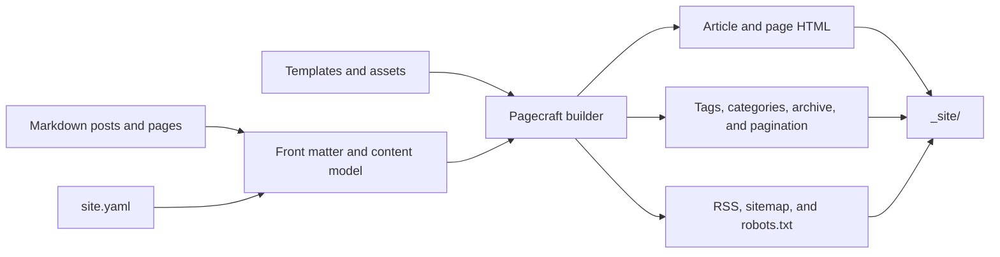

<p align="center">
  
  
  
  
</p>

# Pagecraft

**A Markdown static-site generator for quiet, maintainable publishing.**

[Live demo](https://pagecraft-demo.vercel.app) · [Repository](https://github.com/vincenzo-afk/Pagecraft) · [Report a bug](https://github.com/vincenzo-afk/Pagecraft/issues/new?template=bug_report.yml) · [Request a feature](https://github.com/vincenzo-afk/Pagecraft/issues/new?template=feature_request.yml)

---

## <a name="contents"></a>Contents

- [About Pagecraft](#about-pagecraft)
- [Technology](#technology)
- [Getting started](#getting-started)
- [Using Pagecraft](#using-pagecraft)
- [Command reference](#command-reference)
- [Project structure](#project-structure)
- [Features and roadmap](#features-and-roadmap)
- [Testing and continuous integration](#testing-and-continuous-integration)
- [Deployment](#deployment)
- [Contributing](#contributing)
- [Security](#security)
- [License](#license)
- [Acknowledgements](#acknowledgements)

---

## <a name="about-pagecraft"></a>About Pagecraft

Pagecraft turns a directory of Markdown files into a complete static website. It is intended for small blogs, personal journals, documentation sites, and other writing-first projects where the source should remain readable without a database or hosted content-management system. A site is made of ordinary files: Markdown for posts and pages, `site.yaml` for settings, optional Jinja templates, and assets copied directly into the generated output.

The builder renders article pages alongside the pages a publication needs around them: paginated indexes, tags, categories, archives, an RSS 2.0 feed, a sitemap, and `robots.txt`. It tracks generated files and copied assets in a local manifest, so routine builds write only content that changed and remove stale output when source files disappear.

| Area | Included behavior |
| --- | --- |
| Writing | Markdown, YAML front matter, tables, heading anchors, and Pygments-highlighted fenced code blocks |
| Publishing | Draft and future-post previews, custom slugs, safe permalinks, summaries, dates, and reading-time metadata |
| Organization | Tags, categories, archives, and configurable homepage pagination |
| Discovery | RSS, sitemap, `robots.txt`, canonical URLs, Open Graph metadata, and article metadata |
| Presentation | Bundled Jinja layouts, project-level template overrides, responsive CSS, and light/dark theme support |
| Workflow | Incremental builds, stale-file cleanup, asset synchronization, validation, JSON reports, watch mode, a local server, and post scaffolding |

The [public demo](https://pagecraft-demo.vercel.app) uses the built-in theme and exercises article pages, taxonomy pages, pagination, feed output, discovery files, and syntax highlighting.

### How a build fits together



> Pagecraft calculates the complete public site before deciding what to write. That makes derived pages correct after a post, tag, category, or asset changes, while the manifest avoids rewriting identical output.

---

## <a name="technology"></a>Technology

Pagecraft is a Python package and command-line application. It does not run a database, HTTP API, server-side application, or external service during a normal build.

| Layer | Technology | Verified role |
| --- | --- | --- |
| Runtime | Python 3.10–3.12 | Package support policy and CI matrix |
| Markdown | [Python-Markdown](https://python-markdown.github.io/) `>=3.4` | Markdown rendering and extensions |
| Templates | [Jinja](https://jinja.palletsprojects.com/) `>=3.1` | Built-in and project-overridden HTML layouts |
| Highlighting | [Pygments](https://pygments.org/) `>=2.15` | Fenced-code highlighting and generated styles |
| Metadata | [python-frontmatter](https://github.com/eyeseast/python-frontmatter) `>=1.0` and [PyYAML](https://pyyaml.org/) `>=6.0` | Front matter and `site.yaml` parsing |
| File watching | [watchdog](https://python-watchdog.readthedocs.io/) `>=3.0` | Rebuilds in `watch` and `serve --watch` modes |
| Tests | [pytest](https://docs.pytest.org/) `>=7.0` | Regression suite |
| Packaging | [setuptools](https://setuptools.pypa.io/) and [build](https://pypa-build.readthedocs.io/) | Source distribution and wheel builds |
| Demo hosting | [Vercel](https://vercel.com/) | Static hosting for the public example site |

---

## <a name="getting-started"></a>Getting started

### Prerequisites

Install Python **3.10 or later**. No database, account, API key, or required environment variable is needed to use Pagecraft.

For development, clone the repository and install the development extra:

```bash
git clone https://github.com/vincenzo-afk/Pagecraft.git
cd Pagecraft
python3 -m pip install -e ".[dev]"
```

To use Pagecraft without the development tools, install the package from the checkout instead:

```bash
python3 -m pip install .
```

### Create a first site

```bash
pagecraft init my-journal
cd my-journal
pagecraft new-post "A first entry" --category Writing --tag notes
pagecraft build
pagecraft serve
```

The local server listens on `http://127.0.0.1:8000` by default. Stop it with `Ctrl+C`. The generated `_site/` directory can be deleted and recreated at any time.

### Configuration and environment

A Pagecraft site uses `site.yaml`; it does not use a `.env` file. The only optional environment variable read by the CLI is `EDITOR`, which `pagecraft new-post --editor` uses to open a newly created post.

| Variable | Required | Used by |
| --- | --- | --- |
| `EDITOR` | No | `pagecraft new-post --editor`; the command still creates the post when it is unset |

A compact, complete `site.yaml` looks like this:

```yaml
title: My Journal
description: Notes on writing and tools.
url: https://example.com
author: Your name
language: en

posts_dir: posts
pages_dir: pages
assets_dir: assets
output_dir: _site
permalinks: true

pagination:
  per_page: 6

feed:
  enabled: true
  filename: feed.xml
  posts_limit: 20

sitemap:
  enabled: true
  filename: sitemap.xml

robots:
  enabled: true
  filename: robots.txt

seo:
  default_image: /images/social-card.png
  twitter_handle: ''

theme:
  mode: auto

navigation:
  - label: Home
    url: /
  - label: About
    url: /about.html
  - label: Archive
    url: /archive.html
```

Set `url` to the final public HTTPS address before deployment. When the placeholder `example.com` address is left in place, Pagecraft suppresses sitemap and robots output rather than publishing discovery files with an incorrect canonical domain.

---

## <a name="using-pagecraft"></a>Using Pagecraft

Posts belong in `posts/`; standalone pages belong in `pages/`. Front matter is optional, but it is the place to set publishing state, taxonomy, summaries, and metadata. Pagecraft derives missing titles and slugs from filenames.

```markdown
---
title: A useful entry
date: 2026-08-20
updated: 2026-08-21
categories: [Writing]
tags: [notes, pagecraft]
description: A short description used in listings and metadata.
summary: A smaller excerpt for the homepage.
image: /images/entry-card.png
slug: useful-entry
# permalink: /writing/useful-entry/
# draft: true
---

# A useful entry

Pagecraft renders **Markdown** and highlights fenced code blocks.

```python
from pagecraft.builder import Builder

Builder(".").build()
```
```

A post marked `draft: true` is excluded from a normal build. Use `--drafts` to preview it. A future-dated post is similarly excluded until its publication date; use `--future` during a preview build. Undated standalone pages are published by default.

### Templates and assets

Pagecraft bundles the standard layouts and stylesheet with the installed package. A project can override a built-in layout by placing a same-named file in `templates/`; common choices are `base.html`, `index.html`, `post.html`, and `page.html`. Collection layouts cover tags, categories, and archives.

The default stylesheet is generated as `_site/style.css`. Place project-owned JavaScript, images, fonts, or additional CSS under `assets/`; Pagecraft synchronizes those files into `_site/` and removes stale copies in later builds.

---

## <a name="command-reference"></a>Command reference

Pagecraft is a CLI-only project and does not expose an HTTP API.

| Command | Purpose |
| --- | --- |
| `pagecraft init [path]` | Create a starter site in `path`, or the current directory when omitted, without overwriting existing files. |
| `pagecraft build` | Build incrementally from the existing manifest. |
| `pagecraft build --full` | Ignore the manifest and rewrite generated output. |
| `pagecraft build --drafts --future` | Include draft and future posts for a preview build. |
| `pagecraft build --json` | Emit a machine-readable build report. |
| `pagecraft build --verbose` | List generated, skipped, copied, and removed files. |
| `pagecraft check` | Validate configuration, routes, and local links without writing output. |
| `pagecraft check --json` | Emit validation results as JSON. |
| `pagecraft clean` | Remove the configured output directory and `.pagecraft/` manifest cache. |
| `pagecraft new-post "Title" --draft --category Writing --tag notes` | Create a dated post with selected metadata. |
| `pagecraft new-post "Title" --editor` | Create a post and open it with `$EDITOR` when available. |
| `pagecraft watch` | Build once, then rebuild after source changes. |
| `pagecraft serve --port 8080 --watch` | Build, serve the output locally, and rebuild while editing. |

All build-related commands accept `--project PATH`. `watch` and `serve --watch` also accept `--debounce SECONDS`, which defaults to `0.35` seconds.

---

## <a name="project-structure"></a>Project structure

A generated site is intentionally simple:

```text
my-journal/
├── site.yaml                 # Site identity, navigation, discovery, and build options
├── posts/                    # Markdown blog entries
├── pages/                    # Markdown standalone pages
├── assets/                   # Files copied into the output directory
├── templates/                # Optional overrides for bundled Jinja2 layouts
├── _site/                    # Generated static site; do not edit by hand
└── .pagecraft/               # Incremental-build manifest; do not edit by hand
```

<details>
<summary>Repository layout</summary>

```text
Pagecraft/
├── .github/
│   ├── ISSUE_TEMPLATE/        # Bug and feature forms
│   ├── workflows/test.yml     # Test matrix and package build
│   └── pull_request_template.md
├── example/                   # Source for the public demo journal
├── src/pagecraft/
│   ├── assets.py              # Asset synchronization and stale-file cleanup
│   ├── builder.py             # Collections, output manifest, and generation pipeline
│   ├── cli.py                 # CLI, watcher, and local server
│   ├── config.py              # site.yaml parsing and validation
│   ├── content.py             # Front matter, routes, and publication state
│   ├── discovery.py           # Sitemap and robots output
│   ├── renderer.py            # Markdown and Pygments rendering
│   ├── rss.py                 # RSS 2.0 generation
│   ├── templates.py           # Jinja environment and shared context
│   └── resources/             # Bundled layouts and stylesheet
├── static/                    # Source copy of the bundled stylesheet
├── templates/                 # Source copies of the bundled layouts
├── tests/                     # Pytest regression suite
├── CHANGELOG.md               # Release history
├── CONTRIBUTING.md            # Development and pull-request guidance
├── CODE_OF_CONDUCT.md         # Community standards
├── SECURITY.md                # Private vulnerability-reporting policy
└── pyproject.toml             # Package metadata and dependencies
```
</details>

---

## <a name="features-and-roadmap"></a>Features and roadmap

| Status | Work |
| --- | --- |
| ✅ | Markdown, YAML front matter, syntax highlighting, templates, and assets |
| ✅ | Tags, categories, archive pages, pagination, drafts, future-post previews, RSS, sitemap, and robots output |
| ✅ | Canonical URLs, SEO metadata, route validation, stale-output cleanup, local preview, watch mode, and JSON reports |
| ✅ | Responsive light/dark theme, example journal, CI, source distributions, and wheel builds |
| Deliberately absent in 0.2 | Search, image processing, and a plugin API |

See [CHANGELOG.md](CHANGELOG.md) for release history.

---

## <a name="testing-and-continuous-integration"></a>Testing and continuous integration

The pytest suite covers configuration validation, Markdown rendering, publishing state, taxonomy pages, feed and discovery output, route collisions, incremental builds, stale assets, bundled resources, and command-line behavior.

```bash
python3 -m pip install -e ".[dev]"
python3 -m pytest
python3 -m build
```

GitHub Actions runs tests on Python 3.10, 3.11, and 3.12. A separate workflow job builds both the source distribution and wheel. The workflow is defined in [`.github/workflows/test.yml`](.github/workflows/test.yml).

---

## <a name="deployment"></a>Deployment

Build the site before publishing it to a static host:

```bash
pagecraft build --full
```

Publish the resulting `_site/` directory to any host that serves static files. A hosted project that builds from source needs only Python, the Pagecraft package, a `pagecraft build` step, and `_site/` as the published directory; the final output has no server runtime requirement.

The repository example is deployed at [pagecraft-demo.vercel.app](https://pagecraft-demo.vercel.app). Its `url` setting matches that public address so canonical metadata, RSS links, the sitemap, and `robots.txt` resolve to the deployed site.

---

## <a name="contributing"></a>Contributing

Pagecraft welcomes small, well-tested improvements. Read [CONTRIBUTING.md](CONTRIBUTING.md) for local setup, branch naming, verification, documentation expectations, and pull-request guidance. Community participation is governed by the [Code of Conduct](CODE_OF_CONDUCT.md).

---

## <a name="security"></a>Security

Pagecraft is a local build tool. It validates public routes and permalinks before writing, rejects route collisions, and keeps generated paths inside the selected output directory. The project does not require credentials or transmit source content during a normal build.

Do not report a suspected vulnerability in a public issue. Read [SECURITY.md](SECURITY.md) for the supported version policy and private reporting address.

---

## <a name="license"></a>License

Pagecraft is released under the [MIT License](LICENSE). Copyright © 2026 BHARANI KUMAR S.

---

## <a name="acknowledgements"></a>Acknowledgements

Pagecraft is built on Python-Markdown, Jinja, Pygments, python-frontmatter, PyYAML, and watchdog. These focused libraries keep the generator small while supporting a practical writing workflow.

---

[Back to top](#pagecraft) · [GitHub](https://github.com/vincenzo-afk) · [Live demo](https://pagecraft-demo.vercel.app)
