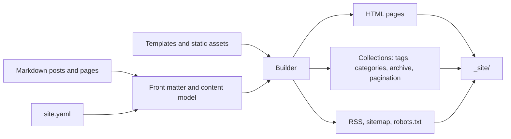

<p align="center">
  
  
  
  
</p>

# Pagecraft

**A small, deliberate static-site generator for people who would rather write in Markdown than manage a CMS.**

[Demo](https://pagecraft-demo.vercel.app) · [Repository](https://github.com/vincenzo-afk/Pagecraft) · [Report an issue](https://github.com/vincenzo-afk/Pagecraft/issues) · [Request a feature](https://github.com/vincenzo-afk/Pagecraft/issues/new)

---

## <a name="contents"></a>Contents

- [What Pagecraft is for](#what-pagecraft-is-for)
- [What it builds](#what-it-builds)
- [How it fits together](#how-it-fits-together)
- [Requirements and installation](#requirements-and-installation)
- [A first site](#a-first-site)
- [Writing posts and pages](#writing-posts-and-pages)
- [Configuring a site](#configuring-a-site)
- [Commands](#commands)
- [Themes and templates](#themes-and-templates)
- [Build behavior](#build-behavior)
- [Project structure](#project-structure)
- [Development and testing](#development-and-testing)
- [Deploying the generated site](#deploying-the-generated-site)
- [Feature status](#feature-status)
- [Contributing](#contributing)
- [Security](#security)
- [License and acknowledgements](#license-and-acknowledgements)

---

## <a name="what-pagecraft-is-for"></a>What Pagecraft is for

Pagecraft turns a directory of Markdown files into a static website. It is aimed at personal journals, documentation sites, small blogs, and other projects where the source should remain readable long after the tool that built it has changed. Posts, pages, assets, and optional template overrides all live in the project directory; the result is an ordinary `_site/` folder containing HTML, CSS, feeds, and discovery files.

The project deliberately has a narrow surface area. There is no database, account system, hosted editor, or required service. The generated files can be reviewed locally and hosted wherever plain static files are accepted.

## <a name="what-it-builds"></a>What it builds

| Area | Included in v0.2 |
| --- | --- |
| Writing | Markdown rendering, YAML front matter, heading anchors, tables, and Pygments-highlighted fenced code blocks |
| Publishing | Draft and future-post controls, dated posts, standalone pages, custom slugs, and safe permalinks |
| Organization | Tags, categories, chronological archives, and configurable homepage pagination |
| Discovery | RSS 2.0 feed, `sitemap.xml`, `robots.txt`, canonical URLs, Open Graph metadata, and article dates |
| Presentation | Jinja2 layouts, project-level template overrides, responsive typography, and a persisted light/dark theme choice |
| Workflow | Incremental output, stale-file cleanup, asset synchronization, validation, JSON reports, watch mode, local serving, and post scaffolding |

The included [demo journal](https://pagecraft-demo.vercel.app) exercises the built-in theme, category pages, tags, archive, pagination, feed, sitemap, and syntax highlighting.

## <a name="how-it-fits-together"></a>How it fits together



The builder first normalizes front matter and public routes, then renders the complete set of derived pages in memory. A versioned manifest records hashes for generated output and copied assets. Unchanged files are left alone, while files no longer represented by the source are removed on the next build. This keeps a quick rebuild from leaving an old tag page or deleted asset behind.

## <a name="requirements-and-installation"></a>Requirements and installation

Pagecraft supports **Python 3.9 or later**. It has no environment variables, API keys, database, or account requirements.

For local development, clone the repository and install the project in editable mode:

```bash
git clone https://github.com/vincenzo-afk/Pagecraft.git
cd Pagecraft
python3 -m pip install -e ".[dev]"
```

The development extra installs the test and packaging tools. To use the generator from the checkout without development extras, install `.` instead.

## <a name="a-first-site"></a>A first site

Create a starter project, add a post, and run a local preview:

```bash
pagecraft init my-journal
cd my-journal
pagecraft new-post "A first entry" --category Writing --tag notes
pagecraft build
pagecraft serve
```

`pagecraft serve` builds the site first and serves `_site/` on `http://127.0.0.1:8000`. Stop the server with `Ctrl+C`. The starter project has a `site.yaml`, a sample post, and an About page; the generated output is always safe to delete and rebuild.

For the repository demo, run the following from the project root:

```bash
pagecraft build --project example --full
pagecraft serve --project example
```

## <a name="writing-posts-and-pages"></a>Writing posts and pages

Posts belong in `posts/`; standalone pages belong in `pages/`. Every file can use YAML front matter, but Pagecraft will derive a title and slug from the filename when those fields are absent.

```markdown
---
title: A useful entry
date: 2026-08-20
updated: 2026-08-21
categories: [Writing]
tags: [notes, pagecraft]
description: A short description used in listings and metadata.
summary: A smaller excerpt for the homepage.
image: /images/entry-card.png
slug: useful-entry
# permalink: /writing/useful-entry/
# draft: true
---

# A useful entry

Pagecraft renders **Markdown** and highlights fenced code blocks.

```python
from pagecraft.builder import Builder

Builder(".").build()
```
```

A post marked `draft: true` is excluded from a normal build. Use `pagecraft build --drafts` to preview it. A future-dated post is also excluded until its date arrives; use `--future` when previewing scheduled content. Standalone pages are published by default even when they do not carry a date.

## <a name="configuring-a-site"></a>Configuring a site

`site.yaml` is the entire project configuration surface. The following is a complete, compact example based on the included demo:

```yaml
title: My Journal
description: Notes on writing and tools.
url: https://example.com
author: Your name
language: en

posts_dir: posts
pages_dir: pages
assets_dir: assets
output_dir: _site
permalinks: true

pagination:
  per_page: 6

feed:
  enabled: true
  filename: feed.xml
  posts_limit: 20

sitemap:
  enabled: true
  filename: sitemap.xml

robots:
  enabled: true
  filename: robots.txt

seo:
  default_image: /images/social-card.png
  twitter_handle: ''

theme:
  mode: auto

navigation:
  - label: Home
    url: /
  - label: About
    url: /about.html
  - label: Archive
    url: /archive.html
```

`theme.mode` accepts `auto`, `light`, or `dark`. When `url` is left at the default placeholder, Pagecraft avoids publishing a sitemap and robots file with a false canonical domain. Set the production URL before deployment so feeds, canonicals, and discovery files point to the right place.

## <a name="commands"></a>Commands

| Command | Purpose |
| --- | --- |
| `pagecraft init [path]` | Create a starter project in `path`, or the current directory when omitted. |
| `pagecraft build` | Build incrementally using the existing manifest. |
| `pagecraft build --full` | Ignore the manifest and rewrite all generated files. |
| `pagecraft build --drafts --future` | Include draft and future posts for a preview build. |
| `pagecraft build --json` | Print a machine-readable build report. |
| `pagecraft build --verbose` | List generated, skipped, copied, and removed files. |
| `pagecraft check` | Validate configuration, routes, and local links without writing output. |
| `pagecraft clean` | Remove `_site/` and `.pagecraft/`. |
| `pagecraft new-post "Title" --draft --category Writing --tag notes` | Create a dated Markdown post with selected metadata. |
| `pagecraft new-post "Title" --editor` | Create a post and open it with `$EDITOR`. |
| `pagecraft watch` | Build once, then rebuild after source changes. |
| `pagecraft serve --port 8080 --watch` | Serve the generated site and rebuild while editing. |

## <a name="themes-and-templates"></a>Themes and templates

The built-in layouts are bundled with Pagecraft, so an installed wheel does not depend on files from the source checkout. A project can override any built-in template by adding a file with the same name under `templates/`. Common overrides are `base.html`, `index.html`, `post.html`, and `page.html`; collection templates cover tags, categories, and the archive.

The standard stylesheet is emitted as `_site/style.css`. Put project-owned images, JavaScript, fonts, or extra CSS in `assets/`; Pagecraft copies them into `_site/` while tracking additions, changes, and deletions. The theme toggle stores a reader’s preference in the browser, while `theme.mode` controls the initial preference.

## <a name="build-behavior"></a>Build behavior

A Pagecraft build calculates the full public site so that derived pages remain correct, then only writes output whose rendered content has changed. The manifest lives at `.pagecraft/manifest.json` and is an implementation detail; do not edit it manually.

| Source change | Result |
| --- | --- |
| Edit a post | Its article, affected indexes, taxonomy pages, feed, archive, sitemap, and any changed derived pages are refreshed. |
| Rename or delete a post | The old generated HTML is removed and collections are rebuilt without it. |
| Add, change, or remove an asset | The matching output asset is synchronized, including stale-file removal. |
| Change a template or configuration | Generated output is updated where the rendered content changes. |
| Run `pagecraft check` | Content is prepared and validated without creating `_site/`. |

Route conflicts and unsafe permalinks stop the build with a readable error rather than silently overwriting a page.

## <a name="project-structure"></a>Project structure

```text
my-journal/
├── site.yaml                 # Site identity, navigation, feeds, and build options
├── posts/                    # Markdown blog entries
├── pages/                    # Markdown standalone pages
├── assets/                   # Files copied into the output directory
├── templates/                # Optional overrides for bundled Jinja2 layouts
├── _site/                    # Generated static site; do not edit by hand
└── .pagecraft/               # Incremental-build manifest; do not edit by hand
```

The Pagecraft repository is organized around the same separation of concerns:

<details>
<summary>Repository layout</summary>

```text
Pagecraft/
├── src/pagecraft/
│   ├── builder.py             # Collection rendering, incremental output, and stale-file cleanup
│   ├── cli.py                 # Command-line interface and local server
│   ├── config.py              # site.yaml parsing and validation
│   ├── content.py             # Front-matter normalization, slugs, routes, and publication state
│   ├── discovery.py           # Sitemap and robots generation
│   ├── renderer.py            # Markdown and Pygments rendering
│   ├── rss.py                 # RSS 2.0 output
│   └── resources/             # Bundled theme and Jinja2 templates
├── templates/                 # Source copies of the bundled layouts
├── static/                    # Source copy of the bundled theme
├── example/                   # Public demo journal
├── tests/                     # Pytest regression suite
├── .github/workflows/test.yml # CI and distribution build
├── CHANGELOG.md               # Release history
└── pyproject.toml             # Package metadata and dependencies
```
</details>

## <a name="development-and-testing"></a>Development and testing

The regression suite uses `pytest` and covers configuration validation, Markdown rendering, publication state, collections, feeds, sitemap and robots output, route collisions, incremental output, stale assets, manifests, and the command-line workflow.

```bash
python3 -m pip install -e ".[dev]"
python3 -m pytest
python3 -m build
```

Continuous integration runs the test suite on Python 3.9, 3.10, 3.11, and 3.12. A separate job builds the source distribution and wheel. The workflow is stored in [`.github/workflows/test.yml`](.github/workflows/test.yml).

## <a name="deploying-the-generated-site"></a>Deploying the generated site

Deployment begins with a normal build:

```bash
pagecraft build --full
```

Upload the resulting `_site/` directory to any static host. For a hosted project that builds from source, install Pagecraft in the build environment, run `pagecraft build`, and configure `_site/` as the published directory. The output has no server runtime requirement.

The repository’s example is deployed at [pagecraft-demo.vercel.app](https://pagecraft-demo.vercel.app). Its `url` setting is intentionally the same public address, which keeps canonical metadata, RSS links, the sitemap, and `robots.txt` consistent with the hosted site.

## <a name="feature-status"></a>Feature status

| Status | Work |
| --- | --- |
| ✅ | Markdown, YAML front matter, syntax highlighting, layouts, and asset synchronization |
| ✅ | Tags, categories, archive, pagination, drafts, future-post previews, RSS, sitemap, and robots output |
| ✅ | SEO metadata, canonical URLs, route validation, stale-output cleanup, local preview, watch mode, and JSON reports |
| ✅ | Responsive light/dark theme, a complete example journal, CI, source distributions, and wheel builds |
| Next | Search, image processing, and plugin APIs are intentionally not part of v0.2. |

Release notes are maintained in [CHANGELOG.md](CHANGELOG.md).

## <a name="contributing"></a>Contributing

Small, focused pull requests are easiest to review. Create a branch named for the change, such as `feat/category-filter` or `fix/rss-date`, add regression coverage for behavior that changed, and run the full test suite before opening a pull request.

Use clear, imperative commit messages. Conventional Commit prefixes such as `feat:` and `fix:` are welcome but not mandatory. Keep user-visible behavior documented when a command, configuration field, or generated file changes.

## <a name="security"></a>Security

Pagecraft is a local build tool. It does not require credentials or send project content to a remote service. It validates public routes and permalinks before writing output, rejects collisions instead of overwriting generated pages, and keeps generated paths inside the selected output directory.

Please do not publish suspected security issues in a public issue. Use GitHub’s private vulnerability-reporting flow for this repository when available, or contact the repository owner directly through [GitHub](https://github.com/vincenzo-afk).

## <a name="license-and-acknowledgements"></a>License and acknowledgements

Pagecraft is available under the [MIT License](LICENSE). Copyright © 2026 [vincenzo-afk](https://github.com/vincenzo-afk).

The project is built with [Python-Markdown](https://python-markdown.github.io/), [Jinja](https://jinja.palletsprojects.com/), [Pygments](https://pygments.org/), [python-frontmatter](https://github.com/eyeseast/python-frontmatter), [PyYAML](https://pyyaml.org/), and [watchdog](https://python-watchdog.readthedocs.io/). Their focused, dependable libraries make a modest publishing tool possible.

---

[Back to top](#pagecraft) · Built and maintained by [vincenzo-afk](https://github.com/vincenzo-afk)
